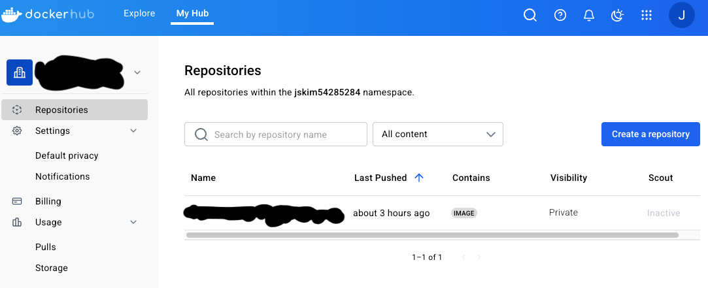
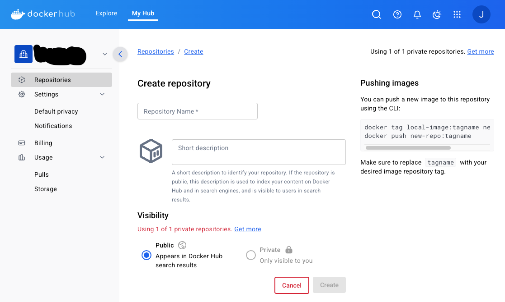

# 🚀 Backend CI/CD 구축 정리 (NestJS + Docker + GitHub Actions)

## 📁 폴더 구조
```
/opt/home-server/
├── backend-dev/            # 개발용 NestJS 코드
├── backend/                # 배포용 NestJS 코드 (빌드 기준)
├── docker-compose.yml
├── nginx/
│   ├── conf.d/
│   │   └── test.arami.kr.conf
│   └── certbot/...         # SSL 인증서 관련
```
## CI/CD 구축 순서

단계 | 설명 | 이유 | 중요도
|----------------------------------------------|------------------------------------|------------------------------------|-----|
✅ 1. Docker Hub 레포지토리 생성 | 이미지를 업로드할 공간을 미리 확보 | 이미지를 푸시하려면 목적지 레포가 먼저 있어야 함 | ⭐⭐⭐⭐
✅ 2. Dockerfile (prod용) 작성 | 배포 가능한 컨테이너 이미지 정의 | CI가 할 일 = 이 Dockerfile로 이미지를 만드는 것 | ⭐⭐⭐⭐
✅ 3. 이미지 빌드 & 푸시 (CLI에서 먼저 테스트) | 수동으로 한번 해보고 GitHub Actions에도 반영 | CI 이전에 빌드/푸시가 정상 작동하는지 확인해야 함 | ⭐⭐⭐
✅ 4. .dockerignore 작성 | 불필요한 파일 제외 (예: node_modules, test 등) | 빌드 속도 향상 + 이미지 용량 절감 = 푸시/배포 효율 | ⭐⭐
✅ 5. docker-compose.yml + .env 정리 | 수동 배포나 로컬 테스트에도 유용 | CI 없이도 단독으로 실행 가능하게 구조 준비 | ⭐⭐
✅ 6. GitHub Actions: deploy-backend.yml 작성 | CI 설정 파일 (자동화된 이미지 빌드/배포 흐름) | 이미지 빌드가 수동으로 잘 된다면 바로 자동화 가능 | ⭐⭐⭐⭐
✅ 7. SSH Key 구성 | 서버에 접속해서 배포하려면 필요 (비밀번호 없이 안전하게) | GitHub Actions에서 서버에 자동 접속하도록 구성할 수 있음 | ⭐⭐⭐
✅ 8. GitHub Secrets 설정 | 민감 정보(.env, SSH key, 포트 등) 안전하게 관리 | Secrets 없이 인증/접속 정보 직접 노출은 위험함 | ⭐⭐⭐⭐
## ⚙️1. Docker Hub 레포지토리 생성 & Docker login 



```bash
/opt/home-server/backend$ docker login -u DockerUserID
password$ Docker_token
```
## ⚙️2.  Docker file 작성
```Dockerfile
# --- 빌더 단계 ---
FROM node:22 as builder
WORKDIR /app

COPY package*.json ./
RUN npm install

COPY . .
RUN npm run build

# --- 런타임 단계 ---
FROM node:22
WORKDIR /app

COPY package*.json ./
RUN npm install --production

COPY --from=builder /app/dist ./dist

CMD ["node", "dist/main"]
```
## ⚙️3.  이미지 빌드 & 푸쉬
```bash
cd /opt/home-server/backend

# 빌드 (Docker Hub ID 바꿔줘!)
docker build -t your_dockerhub_id/home-server-backend:latest .

# 푸시
docker push your_dockerhub_id/home-server-backend:latest
```
## ⚙️4.  .dockerignore 만들기
```dockerignore
.env
.env.*
node_modules
dist
.git
*.log

```

## ⚙️5. docker-compose.yml 추가하기 + .env 파일에 추가하기 
```dockerignore
  backend:
    image: jskim54285284/portfolio-backend:latest
    env_file:
      - .env
    ports:
      - "3000:3000"
    restart: always
    depends_on:
      - postgres
      - minio
    networks:
      - app-net

```
```.env
DB_HOST=postgres
DB_PORT=5432
DB_USERNAME=postgres
DB_PASSWORD=yourpassword
DB_NAME=mydb
```

## ⚙️6. GitHub Actions: deploy-backend.yml


```yaml
ame: 🚀 Deploy Backend

on:
  push:
    branches:
      - main

jobs:
  build-and-deploy:
    runs-on: ubuntu-latest

    steps:
      - name: 📅 Checkout code
        uses: actions/checkout@v3

      - name: 🔧 Node.js 설치 (번전 고정)
        uses: actions/setup-node@v3
        with:
          node-version: 22

      - name: 🔎 투드 버전 확인
        run: |
          node -v
          npm -v
          docker -v
          git --version

      - name: 🐳 Docker Buildx 설정
        uses: docker/setup-buildx-action@v2

      - name: 🔐 Docker Hub 로그인
        uses: docker/login-action@v2
        with:
          username: ${{ secrets.DOCKER_USERNAME }}
          password: ${{ secrets.DOCKER_PASSWORD }}

      - name: 🛠️ Build and Push Backend Docker Image
        run: |
          docker build -t ${{ secrets.DOCKER_USERNAME }}/portfolio-backend:latest ./backend
          docker push ${{ secrets.DOCKER_USERNAME }}/portfolio-backend:latest

      - name: 🧑‍💼 SSH 로 서버에 접속해서 배포
        uses: appleboy/ssh-action@v0.1.10
        with:
          host: ${{ secrets.SERVER_IP }}
          username: ${{ secrets.SERVER_USER }}
          key: ${{ secrets.SSH_PRIVATE_KEY }}
          script: |
            cd /opt/home-server

            echo "🛑 backend 컨테이너 중지 및 제거"
            docker compose stop backend || true
            docker compose rm -f backend || true

            echo "🗑️ 기존 backend 이미지 삭제"
            docker rmi -f ${{ secrets.DOCKER_USERNAME }}/portfolio-backend:latest || true

            echo "📅 새 이미지 pull"
            docker compose pull backend

            echo "🚀 컨테이너 재시작"
            docker compose up -d backend --remove-orphans
```
## ⚙️7. ssh key 구성
```bash
A. 로컬에서 키 생성
ssh-keygen -t ed25519 -C "github-ci"
# → ~/.ssh/id_ed25519.pub (공개키), id_ed25519 (비공개키)
B. 서버에 공개키 등록
cat ~/.ssh/id_ed25519.pub >> ~/.ssh/authorized_keys

C. 비공개키 GitHub에 등록
cat ~/.ssh/id_ed25519로 내용 복사
GitHub Secrets → 이름: SSH_PRIVATE_KEY
value에 전체 복사 (맨 위 -----BEGIN ...부터 아래 -----END ...까지)

```
---

## 🔐8. GitHub Secrets 항목
GitHub → 프로젝트 → Settings → Secrets and variables → Actions에서 추가

| Key | 설명 |
|-----|------|
| `DOCKER_USERNAME` | Docker Hub 사용자명 |
| `DOCKER_PASSWORD` | Docker Hub 패스워드 또는 PAT |
| `SERVER_IP` | 배포할 서버 IP |
| `SERVER_USER` | SSH 사용자명 (보통 `ubuntu`` 등) |
| `SSH_PRIVATE_KEY` | 서버에 접속할 수 있는 개인 키 |
| `SERVER_PORT` | SSH 포트를 22 외에 쓴다면 이 값도 추가 필요 |

---

## ✅9. 배포 동작 요약

1. `main` 브랜치로 push되면 워크플로우 실행
2. Node.js & Docker 환경 확인
3. `/backend` 디렉토리 기준으로 Docker 이미지 빌드
4. Docker Hub에 `portfolio-backend:latest` 푸시
5. 서버 SSH 접속 → 기존 컨테이너/이미지 정리
6. 새 이미지 pull → 컨테이너 재실행

---

## 🧽 남은 정리할 일
- dev용 컨테이너가 항상 nginx에 물려 있으면 안 됨 → conf 분리 or dev 꺼두기
- 사용하지 않는 이미지 수동 정리 (`docker rmi`, `image prune` 등)


---

